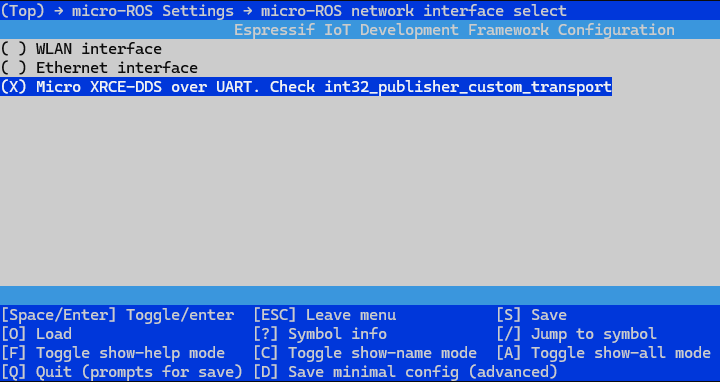

# MicroROS-ESP32-Diffdrive

This is a part of ROS2 and micro-ROS project to control a differential drive robot using an [Yahboom microROS control board](http://www.yahboom.net/study/MicroROS-Board) (ESP32-S3 module). I'm using Ubuntu 22.04 and [ROS2 Humble](https://docs.ros.org/en/humble/Installation.html) running on an orange pi 5b. The connection to ESP32 that running micro-ros is via USB/UART. 


## Setting up ESP-IDF Development Environment 

The first few steps are taken directly from the [ESP-IDF Programming Guide](https://docs.espressif.com/projects/esp-idf/en/latest/esp32s3/index.html).

### Install Prerequisites
Install related dependencies
```bash
  sudo apt-get install git wget flex bison gperf python3 python3-pip python3-venv cmake ninja-build ccache libffi-dev libssl-dev dfu-util libusb-1.0-0
```
### Get ESP-IDF
Download the esp-idf-v5.1.2 version
```bash
mkdir -p ~/esp
cd ~/esp
git clone -b v5.1.2 --recursive https://github.com/espressif/esp-idf.git
```
### Set up the Tools
Install the tools required by ESP-IDF, modifying `esp32s3` to match the chip you are using.
```bash
cd ~/esp/esp-idf
./install.sh esp32s3
```
### Set up the Environment Variables
Add the installed tools to the PATH environment variable. To make the tools usable from the command line.
```bash
source ~/esp/esp-idf/export.sh
```
### Configure, compile and flash firmware
Now connect your ESP32 board to the computer and check under which serial port the board is visible. Navigate to your directory, set ESP32-S3 as the target, and run the project configuration utility menuconfig. You are using this menu to set up project variables.
```bash
cd ~/esp/esp-idf/examples/get-started/hello_world
idf.py set-target esp32s3
idf.py menuconfig
```
Build the project by running
```bash
idf.py build
```
If there are no errors, the build finishes by generating the firmware binary .bin files. Then, run the following command to flash the firmware onto the board.
```bash
idf.py flash
```
Launches the IDF Monitor application. Press `Ctrl+]` to exit.
```bash
idf.py monitor
```
Shortcut command
```bash
idf.py build flash monitor
```
## Install ESP32-microros components
### Download microros components
Download the [microros component](https://github.com/micro-ROS/micro_ros_espidf_component) to `~/esp/Samples/extra_component`.
```bash
mkdir -p ~/esp/Samples/extra_components
cd ~/esp/Samples/extra_components
git clone -b humble https://github.com/micro-ROS/micro_ros_espidf_component.git
cd micro_ros_espidf_component
```
### Install dependencies
This component needs colcon and other Python 3 packages inside the IDF virtual environment in order to build micro-ROS packages
```bash
source ~/esp/esp-idf/export.sh
pip3 install catkin_pkg lark-parser empy colcon-common-extensions
```
### Modify microros configuration
The default microros configuration only supports 1 node, 2 publishers, 2 subscribers, 1 service, 1 client, and 1 history record.

You can modify the `colcon.meta` file in the `micro_ros_espidf_component` directory, find the `rmw_microxrcedds` column, and modify these settings based on the actual requirements. For this project, I will set the publishers, subscribers, and history records to are all modified to 3, To enable communication via USB/UART, I will set the transport mode to 'custom'.
```bash
cd ~/esp/Samples/extra_components/micro_ros_espidf_component
nano colcon.meta
```
```
"rmw_microxrcedds": {
            "cmake-args": [
                "-DRMW_UXRCE_XML_BUFFER_LENGTH=400",
                "-DRMW_UXRCE_TRANSPORT=custom",
                "-DRMW_UXRCE_MAX_NODES=1",
                "-DRMW_UXRCE_MAX_PUBLISHERS=3",
                "-DRMW_UXRCE_MAX_SUBSCRIPTIONS=3",
                "-DRMW_UXRCE_MAX_SERVICES=1",
                "-DRMW_UXRCE_MAX_CLIENTS=1",
                "-DRMW_UXRCE_MAX_HISTORY=3"
            ]
        },
```

If you do not modify it now and need to recompile, you can enter the following command to clear the files generated by microros compilation, and then recompile to generate a microros static library
```bash
cd ~/esp/Samples/extra_components/micro_ros_espidf_component/<your_project>
idf.py clean-microros
```

## Install and start microros agent
Install ROS 2 Humble on your Ubuntu 22.04 LTS, [as instructed here.](https://docs.ros.org/en/humble/Installation.html) Once you have a ROS 2 installation, follow these steps to install and start microros agent.

### Install tinyxml2 dependencies
Enter the following command in the terminal to install tinyxml2.
```bash
cd ~/
git clone https://github.com/leethomason/tinyxml2.git
cd tinyxml2
mkdir build && cd build
sudo cmake ..
sudo make
sudo make install
```
### Install python3-rosdep tool
Enter the following command in the terminal to install the rosdep tool.
```bash
sudo apt install python3-rosdep
```
### Compile micro_ros_setup environment
Activate the ROS2 environment variable.
```bash
source /opt/ros/humble/setup.bash
```
Create and enter the uros_ws workspace.
```bash
mkdir ~/uros_ws && cd ~/uros_ws
mkdir src
```
Download the micro_ros_setup file to the src folder
```bash
git clone -b humble https://github.com/micro-ROS/micro_ros_setup.git src/micro_ros_setup
```
Initialize rosdep
```bash
sudo rosdep init
```
Update rosdep and install related driver packages
```bash
rosdep update && rosdep install --from-paths src --ignore-src -y
```
Compile workspace
```bash
colcon build
```
Activate micro_ros_setup environment
```bash
source install/local_setup.bash
```
### Compile micro_ros_agent environment
```bash
ros2 run micro_ros_setup create_agent_ws.sh
ros2 run micro_ros_setup build_agent.sh
```
### Start microros agent
 `--dev /dev/ttyUSB0` is the serial port device number, and `-b 921600` is the baud rate. Modifications can be made according to your conditions.
```bash
source /opt/ros/humble/setup.bash
source ~/uros_ws/install/local_setup.sh
ros2 run micro_ros_agent micro_ros_agent serial --dev /dev/ttyUSB0 -b 921600 -v4
```

## Usage
### Download microros firmware
You can clone this repo directly in `~/esp/Samples/extra_component/micro_ros_espidf_component`.
```bash
cd ~/esp/Samples/extra_components/micro_ros_espidf_component
git clone https://github.com/PrwTsrt/microros_esp32_diffdrive
cd microros_esp32_diffdrive
```
### Configure, compile and flash firmware
If you encounter issues during the build or set-target process, ensure that you are running in a clean shell environment without the ROS 2 setup script sourced. Remove your `build` directory and retry.
```bash
source ~/esp/esp-idf/export.sh
idf.py set-target esp32s3
idf.py menuconfig
```
By default, micro-ROS component uses UDP transport, To enable UART transport, navigate to `micro-ROS Setting -> micro-ROS network interface select` then select `Micro XRCE-DDS over UART`.

<div align="center">

</div>

```bash
idf.py build
idf.py flash
idf.py monitor
```
After startup, the serial port simulator shows garbled characters due to the incompatible default baud rate and non-character data sent by micro-ROS. Press `Ctrl+]` to exit. Next, start the micro-ROS agent using these commands.


```bash
source /opt/ros/humble/setup.bash
source ~/uros_ws/install/local_setup.sh
ros2 run micro_ros_agent micro_ros_agent serial --dev /dev/ttyUSB0 -b 921600 -v4
```